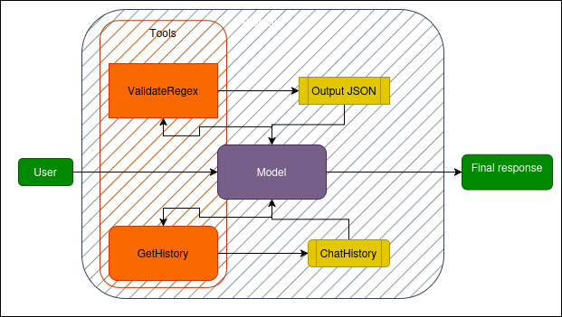

# Regex‑kisegítő AI
_Zápor Ádám · 2025_

Ez a projekt egy interaktív chatbotot és egy automatikus benchmark‑rendszert tartalmaz,  
melyek reguláris kifejezések (regexek) létrehozásában & magyarázatában segítik a felhasználót.

---

## 1  Feladat célja
* **Chatbot‑mód**  
  1. regex _generálása_ természetes nyelvű kérés alapján;  
  2. regex _magyarázata_ (emberi olvasatban);  
  3. korábbi kérdésekre/válaszokra való visszautalás a `ChatHistory`‑nek köszönhetően.  

* **Benchmark‑mód**  
  30 előre definiált feladatot futtat (`benchmarks.py`),  
  és a futás eredményét `bench_stats.json`‑be menti.

---

## 2  Magas szintű architektúra
| Réteg | Fájl | Szerep |
|-------|------|--------|
| **CLI alkalmazás** | `regexp_main.py` | futtatható script, konzolos párbeszéd |
| **Eszköz‑függvények** | `tools.py` | `validate_regex`, `get_history`, stb. |
| **OpenAI‑séma** | `sources.py` | `tools=` mezőhöz tartozó JSON‑sémák |
| **Segéd‑osztályok** | `helpers.py` | `ChatHistory`, `RegexInfo`, serializálás |
| **Benchmark** | `benchmarks.py` | 30 tesztprompt, statisztika‑kiírás |

---

## 3  Kulcs‑fogalmak és függvények

### 3.1 `validate_regex(pattern, test_str=None)` (`tools.py`)
| Lépés | Művelet |
|-------|---------|
| 1 | Pattern _compile_; hibánál `ValueError` |
| 2 | Ha van `test_str`: `search()`. Siker → `is_match=True`, különben `RegexNoMatchError` |
| 3 | Visszatér egy JSON‑stringgel (`RegexInfo.to_json()`) |

### 3.2 `ChatHistory` (`helpers.py`)
* `deque`‑ben tárol max 41 chat‑üzenetet  
* minden üzenet SDK‑objektum → `dict`, így gond nélkül `json.dumps()`‑elhető  
* `get_history(start, end)` → JSON slice, amit az AI tool‑hívással kérhet

### 3.3 Tool‑flow (egy kérdésre)


## 4  Benchmark rendszer
* **Feladatlista:** IPv4, IPv6, e‑mail, ISO‑dátum, stb. (`sources.benchmark_prompts`)
* A modell **kötelezően** meghívja `validate_regex`‑et mint tool
* A wrapper 3 státuszt naplóz: `ok`, `no_match`, `invalid_regex`

```json
{
  "summary": {"calls": 30, "ok": 24, "mismatches": 4, "errors": 2},
  "per_prompt": [ … ]
}
```
## 5 Rövid futtatási útmuató

* 1. virtuális környezet
python3 -m venv .venv && source .venv/bin/activate

* 2. függőségek
pip install -r requirements.txt      # openai, python-dotenv, stb.

* 3. OpenAI API‑kulcs
export OPENAI_API_KEY="sk-…"

* 4a. interaktív chatbot
python regexp_main.py

* 4b. benchmark futtatása
python benchmarks.py      # eredmény: bench_stats.json
